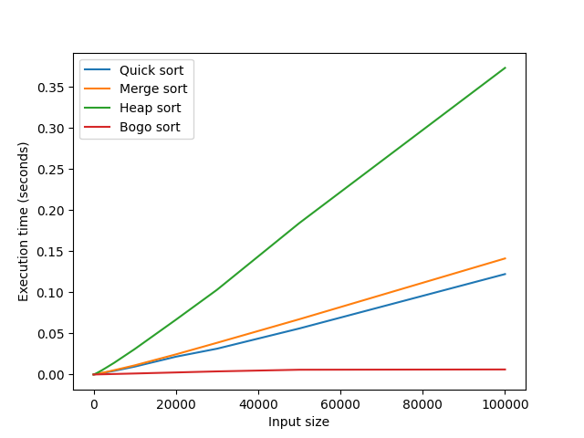

<div align="center"> Ministerul Educaţiei și Cercetării al Republicii Moldova Universitatea Tehnică a Moldovei Facultatea Calculatoare, Informatică și Microelectronică </div>

# <div align="center"> Laboratory work 2:

# <div align="center">Study and empirical analysis of sorting algorithms.Analysis of quickSort, mergeSort, heapSort, bogoSort

<div align="left"> Elaborated: </div>
st. gr. FAF-21X<div align="right"> Cara Alexandr </div>

<div align="left"> Verified: </div>
asist. univ. <div align="right"> Fiștic Cristofor </div>

# BASIC TASK:

1. Implement the algorithms listed above in a programming language
2. Establish the properties of the input data against which the analysis is
performed
3. Choose metrics for comparing algorithms
4. Perform empirical analysis of the proposed algorithms
5. Make a graphical presentation of the data obtained
6. Make a conclusion on the work done.


# <div align="center">Quick sort
QuickSort is a popular sorting algorithm that works by partitioning an array or a list into two parts based on a chosen pivot element. The pivot element is selected from the list, and all other elements in the list are then partitioned based on their value relative to the pivot.

The algorithm then recursively applies this process to each of the two partitions until the entire list is sorted. QuickSort is known for its efficiency, as it has an average time complexity of O(n log n) and a worst-case time complexity of O(n^2).

Here are the basic steps of the QuickSort algorithm:

1. Choose a pivot element from the list
2. Partition the list into two parts based on the pivot: all elements less than the pivot go to one side, and all elements greater than the pivot go to the other side.
3. Recursively apply the process to each of the two partitions until the entire list is sorted.
4. Combine the sorted partitions to form the final sorted list.

There are several variations of QuickSort, including randomized QuickSort and three-way QuickSort, which can further improve its performance in certain cases.

```QuickSort(arr, low, high):
    if low < high:
        pivot_index = Partition(arr, low, high)
        QuickSort(arr, low, pivot_index - 1)
        QuickSort(arr, pivot_index + 1, high)

Partition(arr, low, high):
    pivot = arr[high]
    i = low - 1
    for j = low to high - 1:
        if arr[j] < pivot:
            i++
            swap arr[i] and arr[j]
    swap arr[i + 1] and arr[high]
    return i + 1
```

In this pseudocode, arr is the array to be sorted, low and high are the starting and ending indices of the portion of the array to be sorted.

The Partition function takes the pivot element from the end of the array and partitions the array into two parts: one with all elements smaller than the pivot, and one with all elements greater than or equal to the pivot.

The QuickSort function recursively applies the partitioning process to each sub-array until the entire array is sorted.


# <div align="center">Merge sort
MergeSort is a sorting algorithm that follows the divide-and-conquer paradigm. The algorithm works by repeatedly dividing the input array into two halves, sorting them recursively, and then merging the sorted halves to produce a final sorted array.

Here are the basic steps of the MergeSort algorithm:

1. Divide the unsorted array into two halves, using the middle index as the dividing point.
2. Recursively sort the two halves using MergeSort.
3. Merge the two sorted halves into a single sorted array.
4. The merge step is the key part of the algorithm, where the two sorted sub-arrays are merged into a single sorted array. This is done by comparing the first elements of each sub-array, and taking the smaller element and appending it to the output array. The process is repeated until all elements from both sub-arrays are merged.

MergeSort has a time complexity of O(n log n) in all cases, making it an efficient sorting algorithm.

Here is some pseudocode for the MergeSort algorithm:
```
MergeSort(arr):
    if length(arr) <= 1:
        return arr
    
    mid = length(arr) / 2
    left = MergeSort(arr[0:mid])
    right = MergeSort(arr[mid:])
    
    return Merge(left, right)
    
Merge(left, right):
    result = []
    while length(left) > 0 and length(right) > 0:
        if left[0] <= right[0]:
            result.append(left[0])
            left = left[1:]
        else:
            result.append(right[0])
            right = right[1:]
    
    if length(left) > 0:
        result.extend(left)
    else:
        result.extend(right)
        
    return result
```
In this pseudocode, arr is the unsorted array. The MergeSort function recursively splits the array into two halves, sorts them using MergeSort, and then merges the two sorted halves using the Merge function.

The Merge function takes two sorted arrays, left and right, and merges them into a single sorted array result. It repeatedly compares the first elements of left and right, and appends the smaller element to result. When one of the sub-arrays is empty, the function appends the remaining elements of the other sub-array to result. Finally, the function returns the merged and sorted array result.


# <div align="center">Heap sort
HeapSort is a comparison-based sorting algorithm that uses a binary heap data structure to sort elements in an array. A binary heap is a complete binary tree where every parent node is either greater than or less than its children, depending on whether the heap is a max-heap or a min-heap.

Here are the basic steps of the HeapSort algorithm:

1. Build a binary heap from the input array.
2. Extract the root element of the binary heap, which is the maximum or minimum element depending on whether the heap is a max-heap or a min-heap.
3. Swap the root element with the last element of the heap.
4. Reduce the heap size by one.
5. Restore the heap property by sifting down the new root element to its correct position in the heap.
6. Repeat steps 2-5 until the heap is empty.
7. The output array will be the sorted version of the input array. HeapSort has a worst-case time complexity of O(n log n), making it an efficient sorting algorithm.

Here is some pseudocode for the HeapSort algorithm:
```
HeapSort(arr):
    n = length(arr)
    
    # Build the max heap
    for i in range(n / 2 - 1, -1, -1):
        sift_down(arr, i, n)
    
    # Extract elements from the heap one by one
    for i in range(n - 1, 0, -1):
        # Swap the root element with the last element of the heap
        arr[0], arr[i] = arr[i], arr[0]
        # Reduce the heap size
        n -= 1
        # Restore the max heap property
        sift_down(arr, 0, n)
    
    return arr
    
sift_down(arr, i, n):
    # Sift down the element at index i to its correct position
    while 2 * i + 1 < n:
        j = 2 * i + 1
        if j + 1 < n and arr[j] < arr[j + 1]:
            j += 1
        if arr[i] < arr[j]:
            arr[i], arr[j] = arr[j], arr[i]
            i = j
        else:
            break
```
In this pseudocode, arr is the input array to be sorted. The HeapSort function builds a max heap from the input array, then repeatedly extracts the maximum element from the heap and restores the heap property until the heap is empty. The sift_down function is used to sift down an element to its correct position in the heap, starting from index i.


# <div align="center">Bogo sort

BogoSort, also known as stupid sort, is a highly inefficient sorting algorithm that works by shuffling an array randomly until it is sorted. The algorithm is based on the idea that if you randomly shuffle an array enough times, eventually it will end up sorted.

Here are the basic steps of the BogoSort algorithm:

1. Check if the array is sorted. If it is, the algorithm terminates.
2. Shuffle the array randomly.
3. Repeat steps 1-2 until the array is sorted.
4. 
BogoSort has an average-case time complexity of O(n * n!), where n is the number of elements in the array. This is because the probability of getting the correct order of the elements is 1/n!, which means on average, the algorithm needs to shuffle the array n! times before it becomes sorted.

Due to its extremely poor performance, BogoSort is not used in practice and is only used for educational purposes or as a joke algorithm.

Here is some pseudocode for the BogoSort algorithm:
```
BogoSort(arr):
    while not is_sorted(arr):
        shuffle(arr)
    
    return arr
    
is_sorted(arr):
    for i in range(1, length(arr)):
        if arr[i] < arr[i - 1]:
            return False
    
    return True
```
In this pseudocode, arr is the array to be sorted. The BogoSort function repeatedly shuffles the array randomly until it is sorted, using the is_sorted function to check if the array is sorted or not. The is_sorted function checks if the array is sorted by iterating through the elements and comparing adjacent pairs. If any adjacent pairs are out of order, the function returns False, otherwise, it returns True.


# <div align="center">Conclusion

1. Quick Sort: Quick sort is a divide-and-conquer algorithm that works by selecting a pivot element and partitioning the array around it. It has an average-case time complexity of O(n log n) and a worst-case time complexity of O(n^2). Quick sort is efficient for large arrays and is often used in practice.

2. Merge Sort: Merge sort is a divide-and-conquer algorithm that works by dividing the array in half, sorting each half recursively, and then merging the two sorted halves. It has a time complexity of O(n log n) in all cases. Merge sort is efficient for large arrays, but it requires additional memory for the merge step.

3. Heap Sort: Heap sort is a comparison-based sorting algorithm that uses a binary heap data structure to sort elements in an array. It has a worst-case time complexity of O(n log n), making it an efficient sorting algorithm. However, heap sort requires additional memory to store the heap, and it is not as cache-friendly as quick sort or merge sort.

4. Bogo Sort: Bogo sort is a highly inefficient sorting algorithm that works by shuffling an array randomly until it is sorted. It has an average-case time complexity of O(n * n!), which makes it impractical for any practical use case.




Overall, quick sort, merge sort, and heap sort are all efficient sorting algorithms that are commonly used in practice. Quick sort is often the preferred algorithm due to its average-case time complexity and cache-friendliness. Merge sort is a good choice when additional memory is available for the merge step. Heap sort is a good choice when additional memory is not available and the worst-case time complexity is important. Bogo sort is not a practical algorithm and is only used for educational or joke purposes.
